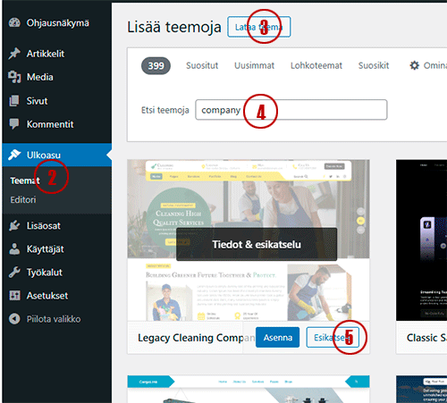
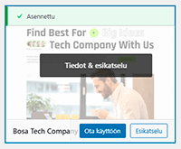
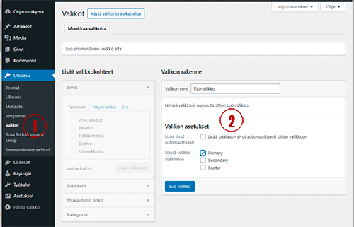
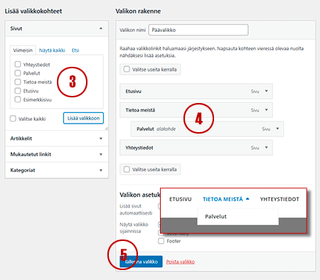
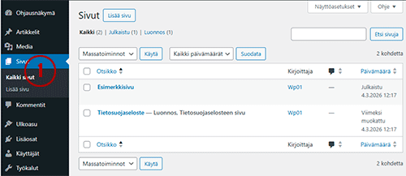
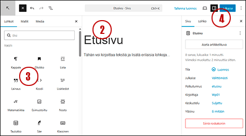
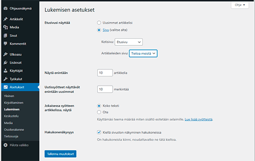
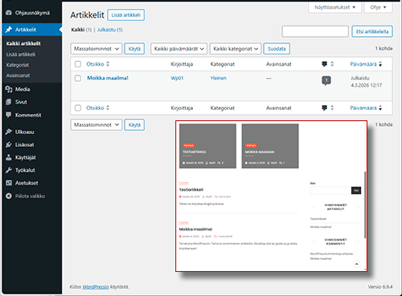

# WordPress – peruskäyttö

Tässä oppaassa käydään läpi WordPressin peruskäyttö. Tavoitteena on oppia luomaan toimiva ja helposti ylläpidettävä verkkosivusto hallitsemalla teemat, valikot, sivut ja blogi.

---

## WordPress-sivuston käyttöönotto

Kun teet verkkosivustoja asiakkaille tai omaan käyttöön, on tärkeää hallita WordPressin perusominaisuudet. Hyvin valittu teema ja selkeä rakenne tekevät sivustosta ammattimaisen ja helppokäyttöisen.

---

## Teeman valinta ja käyttöönotto

Teema määrittää sivuston ulkoasun ja usein myös osan sen toiminnallisuudesta.

### Teeman valitseminen

1. Kirjaudu WordPress-hallintaan  
   👉 `https://www.omadomain.fi/wp-admin`
2. Avaa **Ulkoasu → Teemat**
3. Klikkaa **Lisää uusi**
4. Selaa teemoja tai hae hakusanalla (esim. *blog*, *portfolio*, *yritys*)
5. Käytä **Esikatsele** nähdäksesi teeman
6. Klikkaa **Asenna** ja sitten **Ota käyttöön**

### Vinkkejä teemavalintaan

- Suosi Gutenberg-lohkoeditoria tukevia teemoja
- Vältä liian raskaita ja monimutkaisia teemoja
- Valitse tunnettu ja aktiivisesti päivitetty teema

**Hyviä esimerkkejä:**
- Astra  
- GeneratePress  
- Twenty Twenty ‑sarja  

---

## Valikkojen luominen ja navigaatio

Valikot auttavat sivuston käyttäjiä löytämään sisällön helposti.

### Uuden valikon luonti

1. Avaa **Ulkoasu → Valikot**
2. Klikkaa **Luo uusi valikko**. Anna nimeksi esimerkiksi **Päävalikko**. Valitse valikon sijainti (Primary Menu / Päävalikko).
3. Lisää sivuja tai linkkejä valikkoon
4. Järjestä kohteet vetämällä
5. Tallenna valikko

### Alavalikot

Alavalikon saat tehtyä vetämällä valikkokohdetta hieman oikealle toisen kohteen alle.

---

## Sivujen luominen

Perussivut ovat staattisia sivuja, kuten etusivu ja yhteystiedot.

### Uuden sivun luonti

1. Avaa **Sivut → Lisää uusi**
2. Kirjoita sivun otsikko (esim. *Etusivu*)
3. Lisää sisältö Gutenberg-lohkoeditorilla
4. Klikkaa **Julkaise**

### Suositellut perussivut

- Etusivu  
- Tietoa / Meistä  
- Palvelut tai Tuotteet  
- Yhteystiedot  
- Tietosuojaseloste  

---

## Staattisen etusivun asettaminen (valinnainen)

1. Avaa **Asetukset → Lukeminen**
2. Valitse **Etusivun näyttö → Staattinen sivu**
3. Valitse Etusivuksi esimerkiksi *Etusivu*
4. Valitse Artikkelisivuksi *Blogi*

---

## Blogi ja artikkelit

WordPressin blogi perustuu artikkeleihin.

### Blogiartikkelin julkaisu

1. Avaa **Artikkelit → Lisää uusi**
2. Kirjoita otsikko ja sisältö
3. Lisää tarvittaessa:
   - Artikkelikuva
   - Kategoria (esim. Blogi tai Uutiset)
4. Klikkaa **Julkaise**

### Blogisivun määrittäminen

1. Luo sivu nimeltä **Blogi** (jätä sisältö tyhjäksi)
2. Avaa **Asetukset → Lukeminen**
3. Valitse **Artikkelisivuksi** Blogi

---

## Tehtävä (opiskelijoille)

**WordPress-tehtävä 1**

Luo itsellesi perussivusto valitsemallasi teemalla.

### Sivut, jotka tulee luoda:
- Etusivu  
- Tietoa meistä  
- Palvelut / Tuotteet  
- Yhteystiedot  

